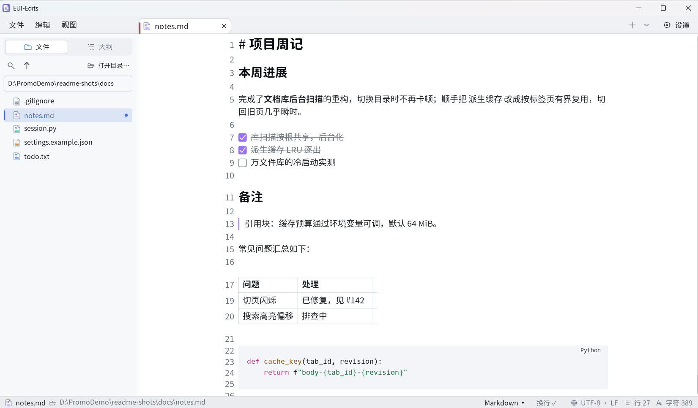
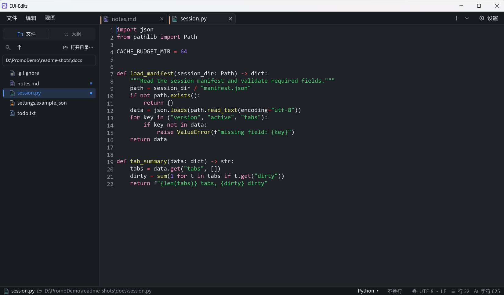
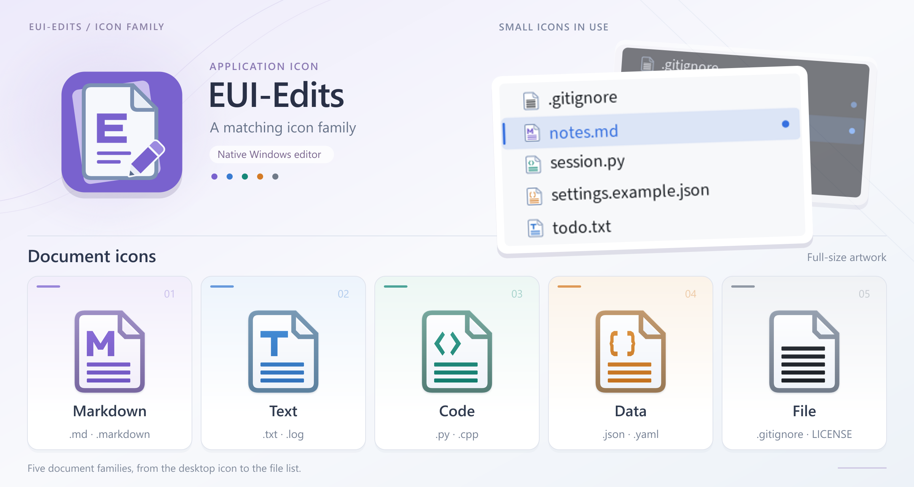

# EUI-Edits

[简体中文](README.md) · English

EUI-Edits is a lightweight native text and Markdown editor for Windows, suited to everyday notes, document writing, and simple edits to source code and configuration files. Markdown is rendered live and edited in place, so formatting follows your input without switching between source and preview.

Built with C++, Win32, and Direct2D, it redraws on demand and embeds no WebView. The install-free release is a single EXE with multiple tabs, a local document library, and recovery of unsaved content.

## Interface preview





The application icon and document icons for Markdown, text, code, data, and other files share one design:



## The editing experience

- **Markdown as you write.** Headings, lists, blockquotes, code blocks, and tables appear directly in the document; the active editing region shows source text. Links are clickable, tasks can be checked, and local images open a preview with zoom and pan.
- **Multiple tabs.** Each tab preserves its caret, selection, undo history, folds, and library view. Opening the same file locates its existing tab; launching the app again forwards file requests to the running window.
- **A local document library.** Browse a folder in the sidebar, including hidden and extensionless files. Opened files are marked with a dot, and `F2` renames items. Directory scanning runs in the background and refreshes on changes; document contents load only when opened.
- **Editing across text formats.** Open Markdown, plain text, source code, and data files. Recognized formats receive basic syntax coloring; "Syntax mode…" changes the presentation manually. Find and replace, word wrap, and line numbers support everyday editing.
- **Saving and recovery.** Saving preserves the original encoding, BOM, and line endings and checks for external changes. Unsaved content is copied periodically for recovery; after an abnormal exit, it can return as separate drafts for review and manual saving.

## Markdown support

| Syntax | Current behavior |
| --- | --- |
| Headings (`#` and underline style), paragraphs | ✅ Live rendering and in-place editing |
| Bold, italic, inline code, strikethrough, underline (`_.._`) | ✅ Supported |
| Links, wiki links (`[[...]]`) | ✅ Clickable navigation |
| Ordered / unordered lists, tasks, blockquotes | ✅ Supported; tasks are clickable, blockquotes nest up to four levels |
| Fenced code blocks, tables, dividers, frontmatter | ✅ Supported |
| Local images on their own line | ✅ Rendered; click to preview |
| Inline math `$...$`, HTML | ⚠️ Math uses code styling; HTML stays as source and is not executed |
| Formula typesetting, remote images, highlights, comments, footnotes, callouts, tags | ❌ Not yet supported; source remains editable |

Markdown covers common writing syntax and some extensions; full Obsidian compatibility is not guaranteed.

## Getting started

Download `EUI-Edits-0.1.1-windows-x64.exe` from the [0.1.1 release page](https://github.com/fclx512/EUI-Edits/releases/tag/neoeditor-v0.1.1), put it where you plan to keep it, and run it directly. No resource folder needs unpacking; the adjacent `.exe.sha256` file is available for verification. The unsigned app targets Windows 10/11 x64. Windows 11 has received on-machine validation; Windows 10 has not received equivalent testing.

**Changes in 0.1.1:** Corrected table cursor mapping and image insertion, reduced long-line layout copying and repeated stationary-drag builds, and moved startup directory loading to the background. See the [release notes](apps/neo_editor/RELEASE-NOTES.md) for changes and validation limits.

### Common actions

| Action | Shortcut / method |
| --- | --- |
| New text / open file | `Ctrl+N` / `Ctrl+O`; files can also be dropped into the window |
| New Markdown | "File → New → Markdown" |
| Save / Save As | `Ctrl+S` / `Ctrl+Shift+S` |
| Close current tab | `Ctrl+W`; modified content prompts for save, discard, or cancel |
| Next / previous tab | `Ctrl+Tab` / `Ctrl+Shift+Tab` |
| Go to tab | `Ctrl+1`–`Ctrl+8` select the matching tab, `Ctrl+9` the last |
| Find / replace | `Ctrl+F` / `Ctrl+H` |
| Next / previous match | With the find bar open: `F3` / `Shift+F3`, or `Ctrl+G` / `Ctrl+Shift+G` |
| Open library / rename | "File → Open folder…"; focus a sidebar item and press `F2` |
| Settings | "View → Settings…" or `Ctrl+,` |

A new document's first save chooses its name and location. For garbled text, choose "File → Reopen with encoding". A failed save, an unrepresentable character, or a cancelled save keeps the document content and does not silently replace the original file.

In image preview, use the wheel to zoom, middle-drag to pan, and left-click or `Esc` to close.

### Settings, recovery, and file associations

Settings live in the current Windows user's profile and do not move with the EXE:

| Location | Contents |
| --- | --- |
| `%APPDATA%\EUI-Edits\settings.ini` | Appearance, fonts, layout, recent files, and other preferences |
| `%APPDATA%\EUI-Edits\session` | Tab sessions and recovery copies of unsaved content |
| `%APPDATA%\EUI-Edits\themes` | Local themes in the theme library |

After an abnormal exit, recovered content opens as separate drafts without automatically overwriting original files. A normal exit clears the recovery session after save or discard confirmations, so all tabs do not automatically reopen next time. Recovery copies are periodic, not per-keystroke saves; save important work yourself.

"Settings → Files & system" registers Open-with entries for the current user, initially selecting TXT and Markdown. Choose the default app separately in Windows. Moving or renaming the EXE requires registering associations again. Script files are edited as text; their code is not executed.

## Appearance and personalization

Most settings take effect immediately and persist across launches:

| Option | Choices |
| --- | --- |
| Language and theme | 简体中文 / English; follow the system theme or choose light / dark |
| Fonts | Separate body, code, and UI fonts; import `.ttf`, `.otf`, or `.ttc`; code fonts are checked for monospace |
| Sizes and scaling | Body size 12–32, UI size 12–18; extra scaling of 80%–200% on top of system DPI |
| Reading layout | Line numbers, status bar, word wrap; readable width narrows and centers the content |
| Library and animations | Simple / library view; hover and press animations can be disabled |

The status bar shows file location, syntax mode, encoding, line endings, line count, and character count, with controls for syntax mode and word wrap; some information collapses in narrow windows. Fonts come from your machine or imports; the release ships no font files.

**Local theme import is a beta feature.** Choose JSON or CSS under "Appearance → Theme file (beta) → Theme library…", or place files in the `themes` folder above. For Obsidian themes, select `manifest.json` with a sibling `theme.css`, or select CSS directly. Import maps recognizable colors only, never executes CSS, and does not promise the original layout or plugin styles. Built-in colors remain available.

## Resource use

The UI redraws on demand. Tab switches reuse layout and highlighting where possible, with less-used derived data released when cache budgets are exceeded. The library scans metadata without loading every document. Disabling interaction animations removes hover and press transition frames.

These are **idle memory measurements of the released 0.1.0 EXE on 2026-10-05**, in MiB: Windows 11, default Win32 / Direct2D software rendering, light theme, 125% system scaling, word wrap and readable width enabled. Each scenario starts three times in separate profiles, idles for 10 seconds after loading, then collects 20 samples per run. Entries are the median of the per-run medians.

| Scenario | Total working set | Private working set | Private commit |
| --- | ---: | ---: | ---: |
| Empty document, one tab | 48.6 | 16.8 | 22.0 |
| Three small Markdown tabs, 2,580 bytes total, idle after visiting each | 57.8 | 23.4 | 32.2 |
| 9 MiB plain text, 73,728 file lines | 184.5 | 152.6 | 194.4 |
| 9 MiB Markdown, same line count, with a list item, emphasis, and inline code on every line | 306.6 | 274.5 | 322.1 |

Total working set counts process pages currently in RAM; private working set is its non-shareable part. Private commit need not all be resident in RAM. These columns cannot be added together or used interchangeably; 1 MiB = 1,048,576 bytes. See the [measurement record](docs/内存实测-2026-10-05.md) for full conditions, the EXE hash, raw data, and reproduction steps.

Line count, Markdown structure, undo history, tab caches, and decoded images also affect memory. These results exclude editing and saving and are neither interaction peaks nor fixed ceilings. Large files need not have the footprint of small documents.

## Current scope

EUI-Edits focuses on local text editing. It provides no knowledge-base management, code completion, build/debug tools, script execution, or presentation mode.

| Area | Support and limits |
| --- | --- |
| Files | Default open limit: **64 MiB**; oversized files, suspected binaries, and unreliable decoding are rejected |
| Encodings | UTF-8, UTF-16 LE / BE, Windows ANSI code pages; saves preserve encoding, BOM, and LF / CRLF characteristics |
| Library | Does not recurse into symbolic-link or junction targets; some explicit file operations refresh synchronously and may take time in large directories |
| Recovery | Up to **256 tab entries**; recovery-body read limits of **256 MiB per file**, **1 GiB total**; damaged manifests or missing bodies are retained and reported, and recovery may be unavailable |

## Development

Building requires Windows, Visual Studio 2022 / 2026 or Build Tools with the C++ desktop workload and Windows SDK, a CMake version supporting that generator, and PowerShell 5.1+. Checks also need Python 3; packaging uses MSVC's `dumpbin.exe`. Dependency sources are included in the repository.

Run from PowerShell at the repository root:

```powershell
# Translation and selected Win32 / Direct2D correctness checks
.\scripts\check-neoeditor.ps1

# Build Release x64 and produce a single EXE with its SHA256 file
.\scripts\package-neoeditor.ps1 -Version 0.1.1
```

The output is `out/euiedits-0.1.1-single-exe/EUI-Edits-0.1.1-windows-x64.exe`. Packaging selects Win32 / Direct2D, statically links the framework and MSVC runtime, embeds icons and licenses, and checks versions, DLL dependencies, and license export. Real-window interaction acceptance is separate.

Scripts locate tools automatically; override with `-CMake` or `-Generator`, plus `-Python` for checks or `-Dumpbin` for packaging. For another build, select a fresh package output with `-OutputDirectory`; existing release files are never overwritten. After moving the source tree, use a fresh build directory rather than a CMake cache containing old paths.

The source folder `apps/neo_editor`, CMake target `neo_editor`, and script names above retain internal identifiers; the product and release files are named **EUI-Edits**. Additional packaging options and historical acceptance records are in the [release build guide](docs/NeoEditor-发布构建说明-2026-10-02.md). Its old names and absolute paths are historical references; the scripts define the current package configuration.

## License and credits

EUI-Edits is built on [EUI-NEO](https://github.com/sudoevolve/EUI-NEO), whose source remains in this repository, under the [Apache-2.0 license](LICENSE). Application and document icons are project-drawn assets. Third-party libraries retain their licenses and attribution; see the [third-party notices](apps/neo_editor/THIRD-PARTY-NOTICES.md) and [LICENSES](apps/neo_editor/LICENSES). Font handling uses the work of the FreeType Team.

Complete license and attribution texts are embedded in the EXE and available in "Settings → About" for viewing and export.
