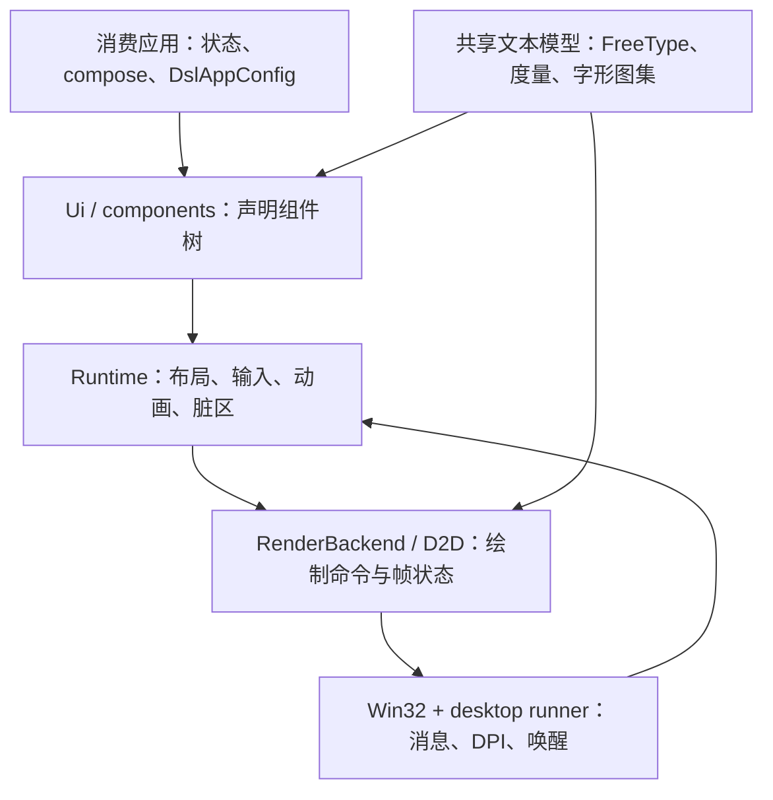

# EUI-NEO 当前技术路线与复用指南

更新：2026-10-09。面向希望复用本项目 UI 库改造的其它桌面项目。

## 0. 知识较少的模型从这里开始

**默认任务：在Windows上创建普通文本/按钮/菜单应用。** 先使用完整冻结fork、Win32+D2D、现有软件/DC默认路径，照第3.2节创建独立消费工程。最初只改消费工程的 `CMakeLists.txt` 和 `app.cpp`，跑通窗口后再加业务组件。改库源码、切硬件或搬单个后端属于另外的任务，要有具体需求和验证。

按以下顺序执行，步骤失败就停在该步骤并记录错误：

1. **确认前提**：目标Windows、已有MSVC x64/Windows SDK/CMake；取得包含未提交必要改动的完整fork快照。缺工具或源码时记录缺项，不猜路径、不清旧构建。
2. **建立目录**：按3.2节目录树放文件；fork根目录内必须有它自己的CMakeLists、core、include、components、3rd等。只克隆本文HEAD不会自动包含当前dirty能力。
3. **复制两个模板**：完整复制3.2节CMakeLists和app.cpp。标题/pageId可改；第一次保持后端、CRT及uiScale设置，用全新构建目录。
4. **构建**：用3.2节configure/build命令，确认两个命令分别退出0以及my_ui.exe实际存在。看到源码文件不等于构建成功。
5. **基础运行**：启动该EXE，记录路径/哈希、窗口显示的文本、关闭结果。若本会话不能操作GUI，记SKIP，不能把构建成功写成实机通过。
6. **按功能验收**：加入输入/菜单/滚动后，执行第6节对应检查。再按需要读第4/5节源码契约和第8节官方手册。

要接入**已有**父工程时，先核对已有库/CRT/CURL策略；不要直接把模板中的CACHE FORCE覆盖其配置。需要blur、逐像素透明窗、透视、GPU纹理/ShaderToy、DirectWrite文字或增量屏幕present时，先看第5节能力表，再决定架构，不能默认本路线已支持。

结果使用明确状态：SOURCE=仅看到源码；PASS=指定动作已执行且结果满足断言；FAIL=已执行但失败；NOT_RUN=尚未执行；SKIP=工具/环境不能覆盖。验收记录必须写清是哪种状态。

## 1. 适用版本与阅读入口

本文描述 **EUI-Edits 仓库内的 EUI-NEO fork**：保留 C++17 声明式 UI、组件和共享文本模型，接入原生 Win32 宿主及实验性 Direct2D 渲染后端，按事件和定时器驱动更新。应用通过配置和组件参数决定主题、字体、动画和业务行为。

当前核对基线是本地 HEAD `daef12b4ec9565ee03062aa762c724b556701079` 加现有 dirty/untracked 工作树。仅锁定该提交**不足以复制当前能力**：第六/七批输入接口和第十批菜单优化等仍有未提交内容。跨项目接入应先保存选定 fork 的提交、完整补丁/必要新增文件和源码哈希，再以该快照构建。UI 库版本与 EUI-Edits 产品版本是不同标识。

资料分工：

- 本文：当前路线、接口契约、接入方式和复用验收要求；作为框架复用的唯一规范入口。
- 旧个人开发笔记与 v0.6.0 差异快查已移到维护者本地 `local-docs/framework/`，不作为当前接口清单。
- [Win32与D2D后端技术要点](EUI-NEO-Win32与D2D后端技术要点-2026-10-08.md)：绑定10-07源码的深入实现分析；旧行号与建议需再查当前源码。
- 应用侧性能批次、候选哈希与实际覆盖记录在维护者本地文档区（`local-docs/repo-docs/`），不替代新项目验收，也不随仓库分发。

本次为源码与文档核对，Luna 完整阅读两份调查并做独立审计，主代理复查关键调用链。**没有构建新消费项目、运行测试、GUI或性能验证，也没有追踪最新上游。** 下文示例是按当前接口整理的接入模板，不能标为已编译通过的跨项目样例。核对快照/哈希及审计笔记分别在 `out/framework-guide-20261009/`、`out/framework-guide-20261009-luna/`。

## 2. 架构与职责

### 2.1 最少需要理解的词

| 词 | 在本文中的具体意思 | 使用规则 |
|---|---|---|
| fork / 上游 | fork是本仓库维护的UI库代码；上游是旧差异调查拿来比较的原项目 | 别把本地接口推断成任意上游版本都有 |
| 宿主 / 后端 | 宿主负责窗口消息和调度；窗口后端提供句柄/事件，渲染后端负责绘制 | 三者由CMake和runner配套选择 |
| HWND / client | HWND是窗口身份；client是排除标题栏/边框的客户区 | 事件和尺寸绑定同一窗口，不拿屏幕坐标直接当客户区坐标 |
| compose / Runtime | compose描述当前控件树；Runtime处理这棵树的状态、布局、输入和绘制 | 修改业务状态后要请求更新，不把compose写成额外主循环 |
| framebuffer / 物理像素 | 后端实际绘制表面的像素尺寸 | 跟Ui逻辑尺寸分别记录 |
| dpiScale / uiScale | 前者由显示器DPI给出，例如125%=1.25；后者是应用额外缩放 | 有效比例为两者乘积 |
| effectiveScale | 框架逻辑单位到绘制像素的有效比例 | Screen与指针回调使用相同换算，不重复缩放 |
| pointerScale | 把窗口输入坐标变成framebuffer坐标的前置比例 | 原生Win32通常1；它不是uiScale |
| render cache / retained layer | 前者保存整窗绘制结果；后者保存某个稳定子树结果 | D2D有前者，禁用后者，不能混为一个开关 |
| dirty rect / full paint | dirty rect是需要重画的区域；full paint要求重建完整画面 | dirty参数存在不证明显示器只更新该区域 |
| render target / device loss | target是D2D绘制目的地；设备失效使相关target资源不可用 | 恢复target及其相关资源，再重画，见第8节 |
| HRESULT / EndDraw | HRESULT是Windows接口返回的成功/错误码；EndDraw结束一次绘制并报告错误 | 返回成功不是鼠标到显示器时间的测量 |
| IME / preedit / result | IME是输入法；preedit是尚未确认的组合文字；result是确认结果 | 组合文字和正式正文分开，不能重复插入确认字符 |
| RC / RCDATA | RC文件描述编译进EXE的资源，RCDATA存二进制数据 | 框架resource view不替消费者生成专用资源 |
| CRT / cache | CRT是C/C++运行库；CMakeCache记录一次构建选择 | 所有模块匹配运行库策略，不复用别的项目cache |



| 层 | 当前职责 / 源码 | 其它项目怎样复用 |
|---|---|---|
| 公共应用入口 | [dsl_app.h](../include/eui/dsl_app.h)、[eui_neo.h](../include/eui_neo.h)：配置及 `app::compose` | 使用公开头与 `eui::neo`；入口由CMake helper选择 |
| 宿主与生命周期 | [desktop_app_main.inl](../core/app/desktop_app_main.inl)、[main_window_runtime.h](../core/app/main_window_runtime.h)、[dsl_window_runtime.h](../core/app/dsl_window_runtime.h) | 主/子窗口、定时唤醒、完整帧防重入、关闭确认、resize须作为一组理解 |
| 窗口后端 | [window_backend.h](../core/window/window_backend.h)、[win32_host.h](../core/window/win32_host.h)、[win32_backend.cpp](../core/window/win32_backend.cpp) | Win32原生消息/IME/曝光补底；GLFW有自己的适配路径，不混用句柄 |
| Runtime与输入 | [dsl_runtime.h](../core/dsl_runtime.h)、[runtime_lifecycle.h](../core/runtime/runtime_lifecycle.h)、[runtime_input.h](../core/runtime/runtime_input.h) | 稳定ID、状态存储、焦点、受控滚动、逻辑回调坐标和更新请求 |
| 文本与图元 | [text.cpp](../core/render/text.cpp)、[render_backend.h](../core/render/render_backend.h)、[D2D后端](../core/render/d2d/d2d_backend.cpp) | 文本先经共享度量/图集；D2D消费命令，不接管为DirectWrite布局 |
| 组件 | [input.h](../components/input.h)、[input_model.h](../components/input_model.h)、[contextmenu.h](../components/contextmenu.h)、[virtuallist.h](../components/virtuallist.h) | 按所需能力选择；本fork组件行为与干净上游不完全相同 |
| EUI-Edits应用 | `apps/neo_editor/ui/`、`state/`、`model/` | 主题、标签、库扫描、LP、恢复和文档命令是应用实现，需另行适配 |

建议先把完整、冻结的 fork 作为源码依赖，再逐项收窄所需模块。手工移植 Win32/D2D 时至少同步 CMake 源码/宏/链接、窗口接口、共享宿主、平台输入、RenderBackend接口、Runtime能力门控及文本/图集依赖；只复制一个 cpp 无法保留这些契约。

## 3. 后端组合与接入

### 3.1 显式选择组合

当前 [CMakeLists.txt](../CMakeLists.txt) 直接约束：

| 组合 | 当前源码状态 |
|---|---|
| Windows + Win32 + D2D | 本项目活动路线；D2D仍标为experimental |
| Windows + GLFW + D2D | 配置允许；本次未验收该组合及设备失效恢复 |
| SDL2 + D2D | 配置拒绝 |
| Win32 + OpenGL/Vulkan/auto | 配置拒绝；Win32明确要求 `EUI_RENDER_BACKEND=d2d` |
| GLFW/SDL2 +其它原后端 | 框架仍有相应选择路径；本指南不扩大当前验收到它们 |

不要把 `auto` 理解为自动选择原生 Win32/D2D；后端由框架配置决定，消费项目不能只手写一个编译宏来跳过源码与链接选择。

### 3.2 源码依赖模板

假设完整 fork 放在消费项目 `vendor/eui-edits-fork/`；使用新唯一构建目录。消费工程目录如下，命令须在**MyUiApp目录**执行：

```text
MyUiApp/
  CMakeLists.txt           # 下面第一个模板
  app.cpp                  # 下面第二个模板
  vendor/eui-edits-fork/   # 完整冻结源码，不是只放编译出的EXE
    CMakeLists.txt
    core/ include/ components/ 3rd/ assets/ scripts/ cmake/ ...
```

模板面向新的独立工程。CACHE FORCE会写入配置选择，静态CRT要与消费工程及依赖一致；合入已有工程应先核对其策略。以下关闭附带应用/夹具等配置，不改库源码。CMake缓存与全局入口/asset属性会影响父工程，**一个构建树只接入一个选定fork/后端组合**。bundled要求源码内依赖完整；缺失时保留CMake错误，不擅自换来源或版本。

```cmake
cmake_minimum_required(VERSION 3.20)
project(MyUiApp LANGUAGES C CXX)

set(CMAKE_MSVC_RUNTIME_LIBRARY "MultiThreaded$<$<CONFIG:Debug>:Debug>")
set(EUI_WINDOW_BACKEND win32 CACHE STRING "Window backend" FORCE)
set(EUI_RENDER_BACKEND d2d CACHE STRING "Render backend" FORCE)
set(EUI_DEPS_MODE bundled CACHE STRING "Dependencies" FORCE)
set(EUI_BUILD_SHARED OFF CACHE BOOL "Static framework" FORCE)
set(EUI_BUILD_APPS OFF CACHE BOOL "Bundled examples" FORCE)
set(EUI_BUILD_USER_APPS OFF CACHE BOOL "Bundled applications" FORCE)
set(EUI_BUILD_NEOEDITOR_ONLY OFF CACHE BOOL "Editor product mode" FORCE)
set(EUI_BUILD_TEST_FIXTURES OFF CACHE BOOL "Framework fixtures" FORCE)
set(EUI_ENABLE_MODULES OFF CACHE BOOL "Optional modules" FORCE)
set(EUI_ENABLE_INSTALL OFF CACHE BOOL "Install package" FORCE)

add_subdirectory(vendor/eui-edits-fork eui-fork-build)
add_executable(my_ui app.cpp)
eui_neo_configure_app(my_ui)
```

`app.cpp` 只实现公开钩子，不再写 main/WinMain，也不重复添加 win32_app_main.cpp：

```cpp
#include "eui_neo.h"

namespace app {
const DslAppConfig& dslAppConfig() {
    static const DslAppConfig config = DslAppConfig{}
        .title("My UI App")
        .pageId("my_ui")
        .windowSize(800, 600)
        .uiScale(1.0f)
        .iconPath("");
    return config;
}

void compose(eui::Ui& ui, const eui::Screen& screen) {
    ui.text("page.label")
        .position(24, 24)
        .size(screen.width - 48, 40)
        .text("Hello EUI-NEO")
        .build();
}
} // namespace app
```

保存两个文件后，用PowerShell配置和构建。示例使用已确认的VS2026工具链；若目标仅有VS2022，应先确认其安装，再把Generator改为 `Visual Studio 17 2022`。CMake变量赋值不会自动调用编译器，configure与build都要执行。

```powershell
# 当前目录必须是消费工程MyUiApp，不能是EUI-Edits仓库根。
if (-not (Test-Path -LiteralPath ./app.cpp) -or
    -not (Test-Path -LiteralPath ./vendor/eui-edits-fork/CMakeLists.txt)) {
    throw 'Consumer files or the complete fork snapshot are missing.'
}
$ConsumerCMakeCommand = Get-Command cmake -ErrorAction SilentlyContinue
if (-not $ConsumerCMakeCommand) {
    throw 'Set $ConsumerCMake to an existing CMake executable, then run the following steps.'
}
$ConsumerCMake = $ConsumerCMakeCommand.Source
$ConsumerBuild = Join-Path (Get-Location).Path ('out/consumer-' + [Guid]::NewGuid().ToString('N'))
if (Test-Path -LiteralPath $ConsumerBuild) { throw 'Choose a new build directory.' }
& $ConsumerCMake -S . -B $ConsumerBuild -G 'Visual Studio 18 2026' -A x64
if ($LASTEXITCODE -ne 0) { throw 'Configure failed. Keep the error log; do not continue.' }
& $ConsumerCMake --build $ConsumerBuild --config Release --target my_ui --parallel 6
if ($LASTEXITCODE -ne 0) { throw 'Build failed. Keep the error log; do not continue.' }
$ConsumerExe = Join-Path $ConsumerBuild 'Release/my_ui.exe'
if (-not (Test-Path -LiteralPath $ConsumerExe)) { throw 'Expected executable not found.' }
Get-FileHash -LiteralPath $ConsumerExe -Algorithm SHA256
& $ConsumerExe
```

若CMake不在PATH，可用下面的赋值/检查，再从上段 `$ConsumerBuild` 赋值开始执行。本机已使用该绝对路径；其它机器先替换为已查明的实际位置，不照猜D盘。

```powershell
$ConsumerCMake = 'D:/ruanjian/Microsoft Visual Studio/Community/Common7/IDE/CommonExtensions/Microsoft/CMake/CMake/bin/cmake.exe'
if (-not (Test-Path -LiteralPath $ConsumerCMake -PathType Leaf)) {
    throw 'Locate an existing CMake executable before continuing.'
}
```

命令失败不删除旧目录。运行EXE需可交互桌面，基础运行后正常关闭；保留helper复制的assets，不先自行删掉它验证“单EXE”。

如果消费工程不使用CURL，可在确认依赖范围后禁用它；`CMAKE_DISABLE_FIND_PACKAGE_CURL` 会影响相应CMake查找范围，不能在依赖CURL的父工程里盲目设TRUE。本模板不替父工程决定CURL策略。

消费者自行选择/校验字体、主题及最小尺寸。`eui_neo_configure_app` 添加入口、链接库、编译/子系统选项，并处理通用assets；`EUI_BUILD_NEOEDITOR_ONLY=ON` 是编辑器产品构建模式，会启用应用选择及专用资源流程，消费项目不应沿用它。

框架也生成 `find_package(EuiNeo CONFIG REQUIRED)` 与 `eui::neo` 安装接口，示例在 [find-package消费者](../tests/consumers/find-package/CMakeLists.txt)。安装包携带已选择的后端，不能在消费侧随意切换宏。当前fork的安装消费、CRT/依赖、入口include和资源路径需单独验证；编辑器单EXE发布通过不证明库安装包已在新项目可用。

## 4. 必须保留的运行时契约

### 4.1 更新、帧状态和按需运行

- `compose` 重建声明树，稳定ID连接Runtime状态和复用实例。文本、名称或数组序号变化不应随意改变控件身份。
- 业务更新与绘制请求是不同入口。外部状态变化应请求更新；需要作废已有像素时请求full paint。调用发生在目标窗口/Runtime的正确归属中，多窗口不能只操作主窗口。
- 定时器登记下一次唤醒，主循环根据动画、帧预算和timer选择轮询或带超时等待。caret、timer、后台唤醒或动画都会影响闲置行为；源码机制不能保证任意消费项目“零CPU”。
- Win32 `pollEvents` 当前每轮最多256条消息、约2ms软预算；剩余消息下轮继续。单个原生/模态处理仍可超预算，不把它当硬实时限制。
- resize有时间闸和补终态请求，完整帧有防重入保护。应保留到期唤醒和最终尺寸帧，不能只减少回调以掩盖不刷新。
- `frameReady()` 失败或 `framePresented()` 未成功时，宿主保留paint请求并要求full paint重试。成功后才消费请求；设备持续失败可能重复请求，不声明已有完善重试退避。

### 4.2 尺寸与坐标

主链为 [dsl_app_impl.h](../include/eui/detail/dsl_app_impl.h) → Runtime → 组件。`effectiveScale = 系统dpiScale × DslAppConfig.uiScale`；Screen/DSL布局按 framebuffer尺寸除effectiveScale得到逻辑尺寸，文本度量也设置相同layoutPixelScale。Runtime回调的局部参数虽名叫dpiScale，主链实际传入的是effectiveScale。

`onPress/onRelease/onDrag/cursorAt` 等得到逻辑坐标，事件与命中矩形使用同一换算；不要再除一遍系统DPI或uiScale。`pointerScale` 是窗口坐标→framebuffer比例，属于前一层输入换算；原生Win32当前窗口/帧缓冲尺寸同为client像素，通常为1，不等于用户设置的uiScale。

例子：系统125%（1.25），应用uiScale=1.2，则effectiveScale=1.5；宽1200个绘制像素对应Screen宽800个逻辑单位。原生Win32客户区鼠标x=300、pointerScale=1时，DSL回调x=200。回调里再除1.5会变成错误的133.33。当前D2D目标固定96 DPI、identity变换，上层已换算命令；不能照微软通用DIP示例再给目标叠一遍缩放。

初始窗口尺寸还有单独契约：Win32 `createWindow` 用系统DPI缩放请求宽高；`WM_GETMINMAXINFO` 用当前窗口DPI处理最小/最大尺寸。EUI-Edits应用又预乘state.systemScale，这是该应用配置与窗口层的组合，**新项目不要照抄scaled(896,608)**。模板用未预乘的设计尺寸；目标项目应核对请求值、client物理尺寸、Screen逻辑尺寸与字体/点击位置，尤其是跨显示器。

Win32包含PMv2初始化与WM_DPICHANGED建议矩形处理，不等于任意布局、字体缓存和混合DPI已验收。

### 4.3 文本、选择与输入

- 文本使用共享FreeType度量/光栅与字形图集，D2D绘制这些图集；不是DirectWrite/ClearType文本路线。换字体时通过统一入口清共享缓存，保持度量、绘制、caret、选区和IME锚点一致。
- 当前文本度量/shape预算为16/8MiB，是相关缓存预算，不能当进程固定内存上限。字体、图集、纹理CPU恢复副本、render cache和应用数据另有占用。
- 输入正文、隐藏标记后的可见位置、视觉行/表格段与几何是不同域。UTF-8字节端点不得直接减1定位中文字形；有装饰的输入需整体带上line map、布局、选择和相应回归。
- `InputBuilder::valueRef` 仅借用稳定lvalue到同步build结束；拒绝临时串，异步/存留builder必须另保证生命周期。拥有值接口与内容比较仍保留。行号复用检查正文、revision、完整布局和无组合输入，不能换成短revision键。
- `onDragUpdate` 返回是否确实改变状态；需要更新时返回true。兼容onDrag仍请求更新，不能用false掩盖滚动/选区变化。相关实现与语义见维护者本地过程记录（`local-docs/repo-docs/`）。
- IME原生Win32实现与GLFW平台桥不同；失焦、指针按下、禁用输入会取消组合。源码有候选位置和UTF-16/UTF-8转换，迟到result及实际输入法行为仍需目标环境验证。
- virtualList要求固定rowHeight；受控offset、可见范围、内容高度与Runtime滚动状态保持同一真值。可变高度列表需要新的测量/索引契约。

## 5. D2D能力与应用定制边界

| 项目 | 当前事实 | 消费侧约束 |
|---|---|---|
| 目标类型 | 经典HwndRenderTarget或DCRenderTarget；无显式D3D11/DeviceContext/DXGI swapchain | 不能按swapchain/增量Present能力设计功能 |
| 默认模式 | Win32下未设置环境变量时software+DC/GDI；精确 `NEO_D2D_SOFTWARE=0` 取消强制软件，走Hwnd目标；software下 `NEO_WIN32_DC=0` 关闭DC路径 | 显式记录配置并分别测目标机器；选项不证明实际GPU、收益或稳定性 |
| retained子树层 | `supportsRetainedLayers=false`，Runtime跳过预热/分配 | 整窗render cache仍存在；禁retained层不等于闲置时持续重绘，也不等于每次重画整窗 |
| render cache / blit | 有容量防抖、缩容/重建；blit当前忽略dirtyRects并全幅拷贝 | Runtime脏区流程与局部屏幕present是不同能力 |
| 设备丢失 | D2DERR_RECREATE_TARGET释放设备资源、保留纹理CPU恢复源、唤醒/full paint；Win32另有notePresentationLost | 目标组合需故障/恢复验收，尤其GLFW+D2D |
| 特效/高级接口 | backdrop/image blur未实现；不覆写ShaderToy、GPU图像/纹理族；变换只处理仿射 | 使用前检查实际能力，明确回退；不把3D/透视退化当正确显示 |
| 透明窗口 | 当前目标ALPHA_MODE_IGNORE | 不能直接支持逐像素透明分层窗口方案 |

单靠换D2D目标不会自动得到DirectWrite、ClearType、GPU effect或可靠device-loss流程。DeviceContext/DXGI/DComposition属于后续架构评估方向，未实现，也不是新项目必须迁移的默认下一步。

应用侧可参照而不应固化为框架默认的内容包括：EditorColors映射theme tokens、UI/编辑字号、语义字体、动画开关、快捷键、可读行宽、标签/侧栏组织、LP和恢复调度。要启用动画可通过应用配置/组件transition，但无需搬入编辑器整套设置系统。

`ContextMenuBuilder::skipClosedContent` 默认false；仅在明确opt-in、闭合且transition关闭时省去隐藏树，并清cascade状态/根offset。开启动画仍保留闭合树。其它项目应选择适合的契约；第十批收益只覆盖编辑器已测条件。

内嵌资源的 [bundled_resources.h](../core/platform/bundled_resources.h) 带有EuiEditsLicenses、AboutIcon固定ID和产品导出CLI/对话框。可参考RCDATA字节view机制，但新项目须定义自己的ID、RC生成、命令和许可证内容；不把这个接口当现成通用资源库。普通框架helper仍可能复制assets，产品单EXE能力来自编辑器专用CMake资源块。

## 6. 复用验收与后续改造

下列是消费项目应自行执行的检查，不是本次通过清单。

| 范围 | 优先复用的现有夹具 | 目标项目还需实际验证 |
|---|---|---|
| 消息/完整帧/resize | [win32_event_pump](../tests/unit/win32_event_pump.cpp)、[frame_reentry](../tests/unit/main_window_frame_reentry.cpp)、[resize_throttle](../tests/unit/dsl_window_resize_throttle.cpp) | 空闲、timer、动画、长处理、关闭否决、resize终态、多窗口归属 |
| 文本与缓存 | [text_metrics_cache](../tests/unit/text_metrics_cache.cpp)、[atlas_growth](../tests/unit/text_atlas_growth.cpp)、[atlas_overflow](../tests/unit/text_atlas_overflow.cpp)、[d2d_cache_capacity](../tests/unit/d2d_cache_capacity.cpp) | 字体/字号/DPI变化、缺字/emoji、图集增长、最小化/遮挡/设备重建 |
| 输入/滚动/菜单 | [pointer_input](../tests/unit/pointer_input.cpp)、[runtime_scroll_sync](../tests/unit/runtime_scroll_sync.cpp)、[context_menu](../tests/unit/context_menu.cpp)、[input_value_reference](../tests/unit/input_value_reference.cpp) | 当前布局的命中、按住/跨视口/正反选区、复制、菜单重开、外部回写 |
| IME | [ime_rect](../tests/unit/ime_rect.cpp)、[win32_input](../tests/unit/win32_input.cpp) | 真实preedit/result/cancel、失焦重入、候选窗、补充平面字符；模型测试不能替代 |
| 打包/消费 | [find-package示例](../tests/consumers/find-package/CMakeLists.txt)、框架CMake helper | 无源码路径/无开发资源兜底启动、依赖/CRT、许可、消费者专属资源 |

新项目记录锁定快照、实际宏/配置、源码/EXE SHA256、机器/窗口/DPI/字体、预热/原始轮次、正常退出和未覆盖项。测试输出与GUI/性能分别验收；EndDraw成功或framePresented为true只证明库内调用/状态，不证明显示器已经显示。软件路径的短时通过不代表硬件GPU、低配、真实IME、跨屏或长期稳定性。

观测入口为 `NEO_GPU_STATS=1` 心跳/累计计数、`NEO_RESIZE_TRACE=1` 有界事件和相应RenderFrameStats；这些旧前缀在当前框架中仍有效。resize trace容量16384，正常退出时输出；有dropped即不完整，不能以日志前缀推全程分布。EUI-Edits的NEO_TABS_TRACE属于应用阶段诊断，普通消费者不会自动获得它。

后续改造按顺序：先接入冻结快照并完成目标组合基础验收，再测应用实际主成本；需要高级绘制能力时才评估新后端，不为追求假定性能先换硬件/换swapchain。改缓存或输入要同时更新失效契约和反例；涉及源码组/公共API时在本文记录迁移影响并更新目标消费测试。

## 7. 常见错误与直接处理

| 看到的问题 / 想做的改动 | 先做什么 | 不能据此做什么 |
|---|---|---|
| 找不到CMake、MSVC或Windows SDK | 核对实际安装/路径并记录缺项；保留配置日志 | 猜其它机器D盘路径、反复换generator碰运气 |
| 缺3rd文件或bundled依赖 | 核对fork快照是否完整、版本是否匹配 | 静默下载任意最新版替换冻结依赖 |
| 出现main/WinMain重复定义 | 消费app只留app命名空间两个函数；入口只由helper添加一次 | 再加一份自写消息循环解决链接问题 |
| 尺寸/点击错位 | 分别记录framebuffer、系统DPI、uiScale、pointerScale、回调逻辑坐标；用4.2节例子对照 | 给所有坐标再乘/除DPI |
| 消费工程闲置仍更新 | 看业务更新、timer、caret、动画与frame请求是谁发的 | 断言库一定零CPU或直接删除定时器 |
| 缺字体/图标/资源 | 看helper是否复制assets，字体路径是否可读；确认消费项目自己的RC和ID | 仅设置EUI_EDITS_BUNDLED_RESOURCES宏就宣称资源已内嵌 |
| 想开启retained子树缓存 | 查supportsRetainedLayers，D2D当前false | 只把门控改true，底层层句柄接口仍未实现 |
| 想要blur/3D/透明窗/ShaderToy/GPU图像 | 先按5节确定能力缺口，写出可读回退或另提后端方案 | 假设微软D2D有该功能就等于本fork已实现 |
| D2D目标丢失/画面不恢复 | 看HRESULT、设备资源释放/重建、paint请求是否保留；按官方资源手册核对 | 忽略错误、沿用失效bitmap/brush或提前清paint标志 |
| 图像trace有dropped | 保留日志，标INCOMPLETE；缩短轨迹或改善采集后另测 | 用留下来的前缀声称全程帧分布 |
| 旧文档说“硬件更快” | 按目标机器分别测配置、正确性和稳定性 | 把NEO_D2D_SOFTWARE=0当成已验收GPU或固定收益 |

不确定API、生命周期或单位时，先查当前声明/调用链及第8节相关官方页。仍缺关键契约时记录问题并停止依赖该判断的改动；保留已完成的可核对工作，不编造实现或PASS。

## 8. 微软官方手册：按问题查，不必一次全读

以下页面于2026-10-09核查可读，来自Microsoft Learn。中文/英文页可在网站切换语言。微软说明的是平台API；本fork是否接入某能力，仍查第5节与源码。官方示例中的DrawText、DeviceContext或独立消息循环不能整段塞进已经由框架管理的入口。

| 何时需要读 | 官方入口 | 读完应能回答的问题 |
|---|---|---|
| 不理解窗口事件和消息循环 | [Window Messages入门](https://learn.microsoft.com/en-us/windows/win32/learnwin32/window-messages) | 消息如何从队列分发到所属窗口；框架为什么要保留宿主循环 |
| 遮挡、窗口曝光和补底错误 | [WM_PAINT](https://learn.microsoft.com/en-us/windows/win32/gdi/wm-paint) | 更新区域和BeginPaint/EndPaint的用途；为何不把每次曝光都当完整业务compose |
| 不理解Hwnd/DC/bitmap target | [Render Targets Overview](https://learn.microsoft.com/en-us/windows/win32/direct2d/render-targets-overview) | 三种绘制目的地差别；BeginDraw/EndDraw在何处配对 |
| D2DERR_RECREATE_TARGET或资源失效 | [Resources Overview](https://learn.microsoft.com/en-us/windows/win32/direct2d/resources-and-resource-domains) | 哪些资源依赖target/设备；重建时哪些资源不能继续沿用 |
| 不清楚EndDraw成功/失败语义 | [EndDraw接口](https://learn.microsoft.com/en-us/windows/win32/api/d2d1/nf-d2d1-id2d1rendertarget-enddraw) | 批量绘制何时完成、错误码如何返回；一次BeginDraw只能配一次EndDraw |
| 高DPI、跨屏和窗口缩放 | [Windows高DPI开发](https://learn.microsoft.com/zh-cn/windows/win32/hidpi/high-dpi-desktop-application-development-on-windows)、[Direct2D与DIP](https://learn.microsoft.com/en-us/windows/win32/direct2d/direct2d-and-high-dpi) | 标准DIP与物理像素的关系、DPI变化通知；为什么本fork还要单独处理uiScale且避免重复缩放 |
| 中文组合/确认/取消问题 | [WM_IME_COMPOSITION](https://learn.microsoft.com/en-us/windows/win32/intl/wm-ime-composition) | 组合状态、GCS_COMPSTR/GCS_RESULTSTR与取消各表示什么；本地事件适配如何避免重复文字 |
| 给消费EXE嵌入资源 | [Resource-Definition Statements](https://learn.microsoft.com/en-us/windows/win32/menurc/resource-definition-statements)、[Using Resources](https://learn.microsoft.com/en-us/windows/win32/menurc/using-resources) | RC如何把有ID的资源编入EXE；运行时如何查找/取得资源数据 |

阅读顺序：只接普通UI先读消息入门和第3节；处理缩放再读DPI两页；处理设备错误再读target/resources/EndDraw；接入输入法或嵌入资源时才读对应行。未读平台文档不要靠术语推断接口行为。

## 9. 给下一位执行模型的最小交接

每次交付至少留下以下字段，避免下一模型重复猜测：

```text
目标：新建独立UI应用 / 已有消费工程接入 / 维护框架（选择本次实际任务）
源码身份：fork提交 + 必要dirty补丁/新增文件 + 关键源码SHA256
构建：消费根目录、构建目录、generator、x64/Release、CRT、两个后端、依赖模式
修改：实际改动文件与API，不支持/未采用的功能及原因
验证：configure/build退出码；EXE路径/哈希；GUI/相关测试实际结果
覆盖缺口：NOT_RUN、SKIP、失败日志及停止原因
下一步：一个具体动作、对应源文件、通过条件
```

这些字段缺失时，不补写看似完整的结果。本文仍是SOURCE指导；新工程是否真正可用，以该工程自己的构建、实机和回归记录为准。
