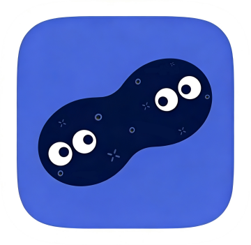

# Live Preview coverage probe

Plain text with **strong**, *emphasis*, `inline code`, ~~strike~~, <u>underline</u>, and [a link](https://example.com).

## Heading and setext

Setext heading
---

Text after the setext heading.

### Quotes and lists

> Quote level one
> > Quote level two

- First item
  - Nested item
- [ ] Open task
- [x] Finished task

### Code

```cpp
int main() { return 0; }
```

### Table

| Left | Center | Right |
| :--- | :----: | ----: |
| a | b | c |

### Thematic breaks

Before a break.

---

After dashes.

***

After stars.

___

After underscores.

- - -

After spaced dashes.

### Local image


